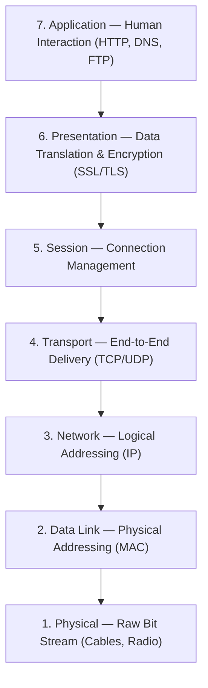
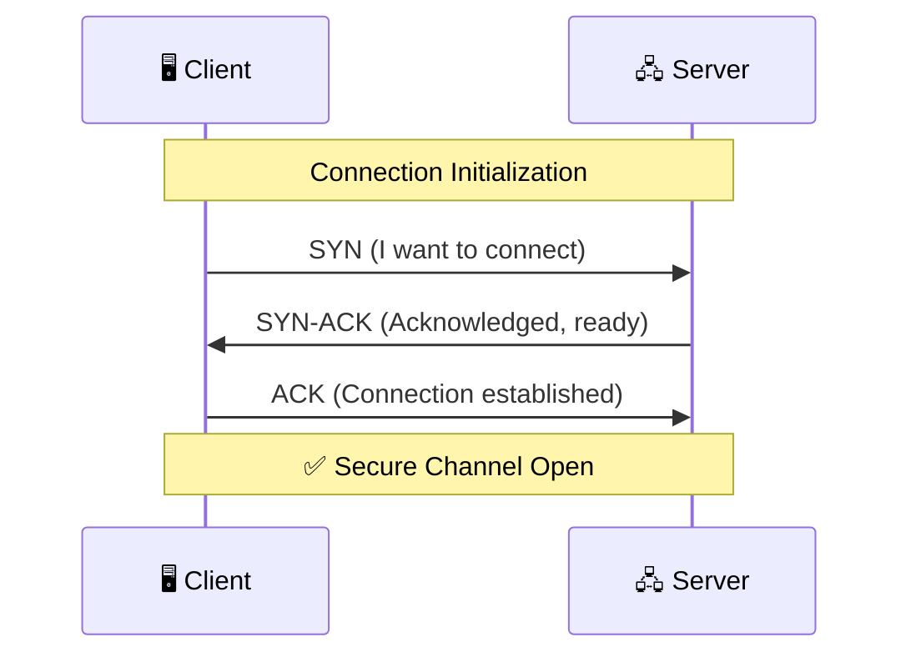

# 🛡️ OSI Model: Network Architecture & Security Deep-Dive

The **Open Systems Interconnection (OSI) model** is a conceptual framework that standardizes network communication into seven distinct layers. Developed by the ISO in 1984, it serves as a vendor-neutral standard to diagnose network issues and guide security architecture. For security professionals, the OSI model is essential for **mapping attacks to exact layers** and pinpointing where an exploit executes.

---

## 📖 Table of Contents

- [OSI vs. TCP/IP](#-osi-vs-tcpip)
- [The 7-Layer Architecture](#-the-7-layer-architecture)
- [Layer-by-Layer Breakdown](#-layer-by-layer-breakdown)
  - [L1: Physical Layer](#l1-physical-layer)
  - [L2: Data Link Layer](#l2-data-link-layer)
  - [L3: Network Layer](#l3-network-layer)
  - [L4: Transport Layer](#l4-transport-layer)
  - [L5: Session Layer](#l5-session-layer)
  - [L6: Presentation Layer](#l6-presentation-layer)
  - [L7: Application Layer](#l7-application-layer)
- [Threat Mapping Matrix](#-threat-mapping-matrix)
- [Key Takeaways](#-key-takeaways)
- [Additional Resources](#-additional-resources)
- [Author](#️-author)

---

## 🆚 OSI vs. TCP/IP

While the OSI model is the gold standard for diagnostics and theoretical mapping, the **TCP/IP model** is the actual protocol stack used on the internet.

| Feature | OSI Model | TCP/IP Model |
|---|---|---|
| **Structure** | 7 Layers | 4 Layers |
| **Status** | Theoretical | Practical |
| **Primary Use** | Diagnostic Tool | Internet Standard |
| **Best For** | Security Architecture | Network Implementation |

---

## 🏗️ The 7-Layer Architecture

### Visualizing the Stack

### 🧠 Memory Mnemonics

| Direction | Mnemonic |
|---|---|
| **Top → Bottom (7 to 1)** | **A**ll **P**eople **S**hould **T**ry **N**ew **D**omino's **P**izza |
| **Bottom → Top (1 to 7)** | **P**lease **D**o **N**ot **T**hrow **S**ausage **P**izza **A**way |

---

## 🔍 Layer-by-Layer Breakdown

### L1: Physical Layer

- **Responsibility:** Transmits raw bit streams over physical mediums — cables, fiber optics, and radio frequencies.
- **AppSec Context:** Physical security breaches, including hardware wiretapping and insertion of rogue devices.
- **Primary Threat:** `Physical Tapping` / `Rogue Hardware`
- **Relevant Tools:** `Rubber Ducky` `Proxmark` `LAN Turtle`

> [!WARNING]
> Hardware-level security is often the **weakest link**. A single unauthorized **Rubber Ducky** can bypass all software-layer firewalls by emulating a trusted keyboard input device.

---

### L2: Data Link Layer

- **Responsibility:** Node-to-node data transfer within a local network using physical **(MAC) addressing**, managed by switches and NICs.
- **AppSec Context:** Attacks originating **within the LAN** — intercepting traffic between devices on the same subnet.
- **Primary Threat:** `ARP Spoofing` / `MITM (Man-in-the-Middle)`
- **Relevant Tools:** `Ettercap` `arpspoof` `Bettercap`

---

### L3: Network Layer

- **Responsibility:** Manages logical addressing **(IP addresses)** and routing — determining a packet's path across interconnected networks.
- **AppSec Context:** Network boundary testing, firewall rule analysis, and routing protocol exploitation.
- **Primary Threat:** `IP Spoofing` / `Firewall Bypass`
- **Relevant Tools:** `traceroute` `hping3` `Scapy`

---

### L4: Transport Layer

- **Responsibility:** End-to-end data delivery via **TCP** (reliable, connection-oriented) and **UDP** (fast, connectionless) using port numbers.
- **AppSec Context:** The **primary layer for reconnaissance** — enumerating open ports and services to map the attack surface.
- **Primary Threat:** `Port Scanning` / `SYN Flood`
- **Relevant Tools:** `Nmap` `Netcat` `Masscan`

#### TCP Three-Way Handshake

> [!IMPORTANT]
> **SYN Flood attacks** exploit this handshake by sending thousands of `SYN` packets without completing the `ACK`, exhausting server resources and causing a Denial of Service (DoS).

---

### L5: Session Layer

- **Responsibility:** Establishes, manages, and terminates **communication sessions** between local and remote applications.
- **AppSec Context:** Attackers forge or steal valid session tokens to **impersonate authenticated users**.
- **Primary Threat:** `Session Hijacking` / `Session Fixation`
- **Relevant Tools:** `Burp Suite` `Cookie Manager` `Wireshark`

---

### L6: Presentation Layer

- **Responsibility:** Data translation, **encryption (SSL/TLS)**, compression, and formatting between application and network formats.
- **AppSec Context:** Assessment of weak cipher suites, certificate validation failures, and protocol downgrade attacks.
- **Primary Threat:** `SSL Stripping` / `Weak Cipher Suites`
- **Relevant Tools:** `Wireshark` `SSLScan` `TestSSL.sh`

---

### L7: Application Layer

- **Responsibility:** The human-computer interaction layer — handles protocols like `HTTP`, `FTP`, `DNS`, and `SMTP`.
- **AppSec Context:** The **highest-value target**. Business logic flaws and code-level injection attacks execute entirely at this layer.
- **Primary Threat:** `SQL Injection (SQLi)` / `Cross-Site Scripting (XSS)` / `Logic Flaws`
- **Relevant Tools:** `Burp Suite` `OWASP ZAP` `SQLMap`

---

## 🗺️ Threat Mapping Matrix

| Layer | Primary Target | Primary Threat | Security Control |
|---|---|---|---|
| **L7 — Application** | User Interaction | SQLi / XSS / Logic Flaws | WAF, Input Validation |
| **L6 — Presentation** | Data Formatting | SSL Stripping / Weak Ciphers | Strong TLS Config, HSTS |
| **L5 — Session** | Session Tokens | Session Hijacking / Fixation | Secure Cookies, Timeouts |
| **L4 — Transport** | Ports & Protocols | Port Scanning / SYN Flood | Firewalls, Rate Limiting |
| **L3 — Network** | IP Routing | IP Spoofing / Firewall Bypass | IPSec, ACLs |
| **L2 — Data Link** | MAC Addressing | ARP Poisoning / MITM | Port Security, DAI |
| **L1 — Physical** | Hardware & Cables | Wiretapping / Rogue HW | Physical Locks, Surveillance |

---

## 💡 Key Takeaways

> [!IMPORTANT]
> **Map the attack. Secure the layer.** Effective cybersecurity is not about general defense — it requires identifying the **exact layer** where a vulnerability executes and deploying the corresponding mitigation control.

> [!WARNING]
> **Security is only as strong as its weakest layer.** An application with perfect encryption at L6 and L7 can still be fully compromised by a rogue hardware device inserted at L1.

---

## 🔗 Additional Resources

To provide a complete learning experience, the original visual materials and a full practical walkthrough are linked below:

- 📺 **Watch the Tutorial:** [Deep Dive: OSI Model & Attack Surface Mapping](https://www.youtube.com/@MuhammadAqibTayyab) — Full explanation in Urdu/Hindi for the desi cybersecurity community.
- 📊 **Original Deck:** [Download Presentation (PPTX)](OSI_Model_Aqib.pdf) — The original slides used in the video for your own study and reference.
- 💼 **Connect & Collaborate:** If you are navigating AppSec, Purple Teaming, or SOC Operations, connect on [LinkedIn](https://www.linkedin.com/in/muhammad-aqib-tayyab-ethical-hacker/).

---

## 🙋‍♂️ Author

**Muhammad Aqib Tayyab** — AppSec & Purple Team Student | Ethical Hacker | Bug Bounty Hunter

I am a **BS-IT undergraduate at NUML, Pakistan**, pursuing a *"Learning in Public"* philosophy — documenting my technical cybersecurity journey to build high-quality, accessible resources for the community.

---

> *Part of the **Learning in Public** initiative — providing technical cybersecurity tutorials for the Urdu/Hindi-speaking community.*

`#Cybersecurity` `#OSIModel` `#NetworkSecurity` `#AppSec` `#EthicalHacking` `#LearningInPublic` `#PurpleTeam` `#Pakistan` `#NUML` `#BugBounty`
